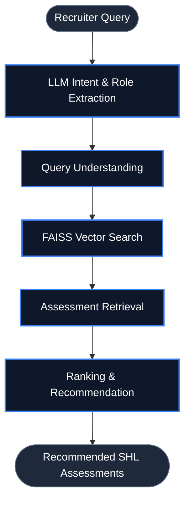

# 🎯 SHL Assessment Recommendation System

### 👨‍💻 Author

**Rishiraj Karn**
M.Sc. Data Science and Management
IIT Ropar & IIM Amritsar
AI/ML Intern @ Annam AI

📧 [rishirajkarn938@gmail.com](mailto:your-rishirajkarn938@egmail.com)
🔗 LinkedIn: https://www.linkedin.com/in/rishi1106/
🔗 GitHub: https://github.com/Rishi1106-Data

## 🧠 Architecture Workflow

An AI-powered assessment recommendation platform that helps recruiters identify the most relevant SHL assessments for a given job role using Large Language Models (LLMs), semantic search, and retrieval-augmented generation (RAG).

Built with **FastAPI, FAISS, Sentence Transformers, and Groq LLM (Llama 3.1)**.

---

## 🧠 Architecture Workflow



---

## 🚀 Features

* 🤖 LLM-powered conversational recommendation engine
* 🔍 Semantic search using Sentence Transformers
* 📚 Vector database retrieval using FAISS
* 💬 Multi-turn recruiter conversations
* ⚡ FastAPI REST API backend
* 🎯 Assessment ranking and recommendation workflow
* 🛡️ Prompt injection and off-topic query handling

---

## 📊 Technical Highlights

* Indexed **377+ SHL assessments**
* Built using **384-dimensional embeddings**
* Retrieval-Augmented Generation (RAG) architecture
* Groq-powered Llama 3.1 inference
* Semantic role-to-assessment matching
* JSON-based agent orchestration

---

## 🏗️ Tech Stack

| Component     | Technology                  |
| ------------- | --------------------------- |
| Backend       | FastAPI                     |
| LLM           | Groq (Llama 3.1-8B Instant) |
| Embeddings    | Sentence Transformers       |
| Vector Store  | FAISS                       |
| Language      | Python                      |
| API Docs      | Swagger UI                  |
| Configuration | dotenv                      |

---

## 🚀 How to Run

### 1. Clone Repository

```bash
git clone <repository-url>
cd SHL-ai-agent
```

### 2. Install Dependencies

```bash
pip install -r requirements.txt
```

### 3. Configure Environment

Create `.env`

```env
LLM_PROVIDER=groq
GROQ_API_KEY=your_key_here
GROQ_MODEL=llama-3.1-8b-instant
```

### 4. Start Server

```bash
python -m uvicorn app.main:app --reload
```

### 5. Open API Docs

```text
http://127.0.0.1:8000/docs
```

---

## 📡 API Example

### Request

```json
{
  "messages": [
    {
      "role": "user",
      "content": "Role: Data Scientist. Experience: 3 years."
    }
  ]
}
```

### Response

```json
{
  "reply": "I'd be happy to recommend some assessments...",
  "recommendations": [
    {
      "name": "Data Science (New)"
    }
  ]
}
```

---

## 📂 Project Structure

| File                 | Purpose                             |
| -------------------- | ----------------------------------- |
| `app/main.py`        | FastAPI application and endpoints   |
| `app/agent.py`       | Conversational recommendation agent |
| `app/llm.py`         | LLM integration (Groq/Gemini)       |
| `app/prompts.py`     | Agent prompts and instructions      |
| `app/chat_schema.py` | Request/response schemas            |
| `config.py`          | Environment configuration           |
| `data/`              | SHL assessment dataset              |
| `faiss_index/`       | Vector search index                 |

---

## 🎯 Sample Use Cases

* Talent Acquisition
* Hiring Assessment Selection
* Candidate Screening
* Skill Evaluation Planning
* Recruitment Automation

---

## 📈 Future Improvements

* Multi-agent recommendation pipeline
* Assessment comparison engine
* Recruiter dashboard
* LangGraph integration
* Evaluation framework with LangSmith

---

